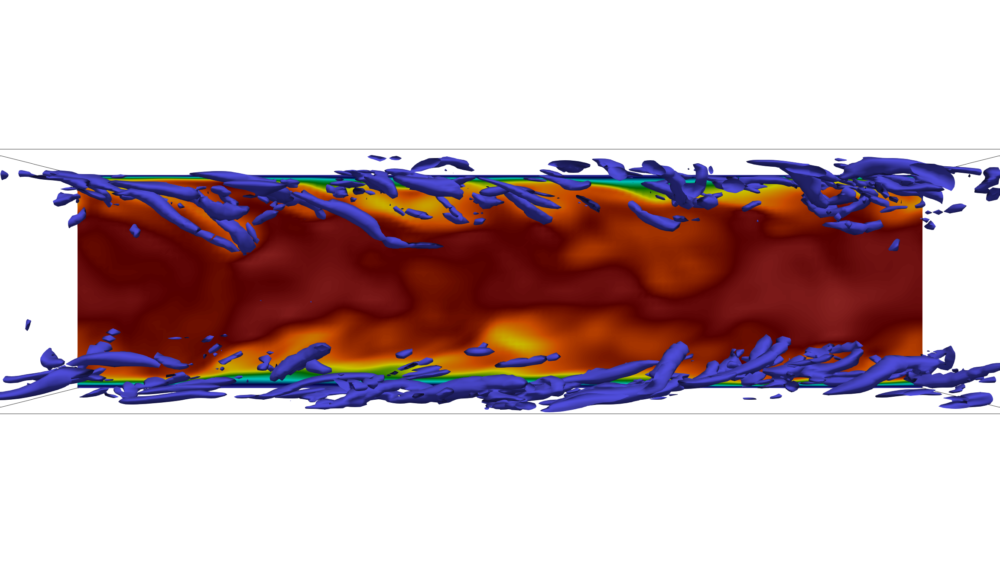

================================
Periodic turbulent channel flow
================================
The periodic turbulent channel flow is a well-known benchmark in CFD, to study wall-bounded turbulence. It is attractive as a test case due to its simple setup, and it is well documented in the literature with plenty of database available.

DNS Reτ= 180
=============
Have a look at the following `video <https://www.youtube.com/watch?v=xFa0kEaUFCQ>`_ to see how to run a turbulent channel flow simulation with Xcompact3d and post-process the data with Py4Incompact3d. 

In the video, it is shown how to perform a Direct Numerical Simulation of the turbulent channel flow case with a Reynolds number equal to 180. The simulation should take few hours on a dozen of CPU cores to collect converged statistics.

You will see how to use **Paraview** to visualise the snapshots and **Py4Incompact3d** to generate the statistics. The key parameters in the input file are also discussed.

For this case, ``input_DNS_Re180_LR_explicittime.i3d`` from the ``examples/Channel-Flow`` directory is used. Information is also provided on how to use the small Fortran file ``stretching_parameter_channel.f90`` which can be use for: (i) determine the stretching intensity close to the wall via the ``beta`` parameters (see *Laizet, S., & Lamballais, E. (2009)* **High-order compact schemes for incompressible flows: A simple and efficient method with quasi-spectral accuracy.** *Journal of Computational Physics, 228(16), 5989-6015*, `web link <https://www.sciencedirect.com/science/article/pii/S0021999109002587>`_); (ii) determine the input Reynolds number of the simulation (the Reynolds number in the input file in Xcompact3d is based on the centreline velocity of a Poisseuille profile and half the height of the channel flow).

The statistics generated with **Py4Incompact3d** are compared with two sets of reference data (available in ``examples/Channel-Flow` directory of **Py4Incompact3d**):

1-*Lee, M., & Moser, R. D. (2015).* **Direct numerical simulation of turbulent channel flow up to Reτ=5,200.** *Journal of fluid mechanics, 774, 395-415.*

2-*Vreman, A. W., & Kuerten, J. G. (2014).* **Comparison of direct numerical simulation databases of turbulent channel flow at Reτ= 180.** *Physics of Fluids, 26(1), 015102.*

