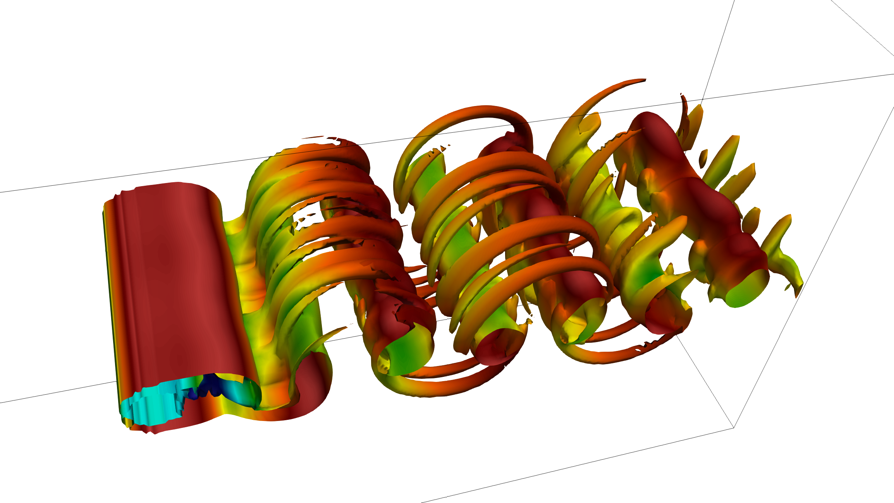
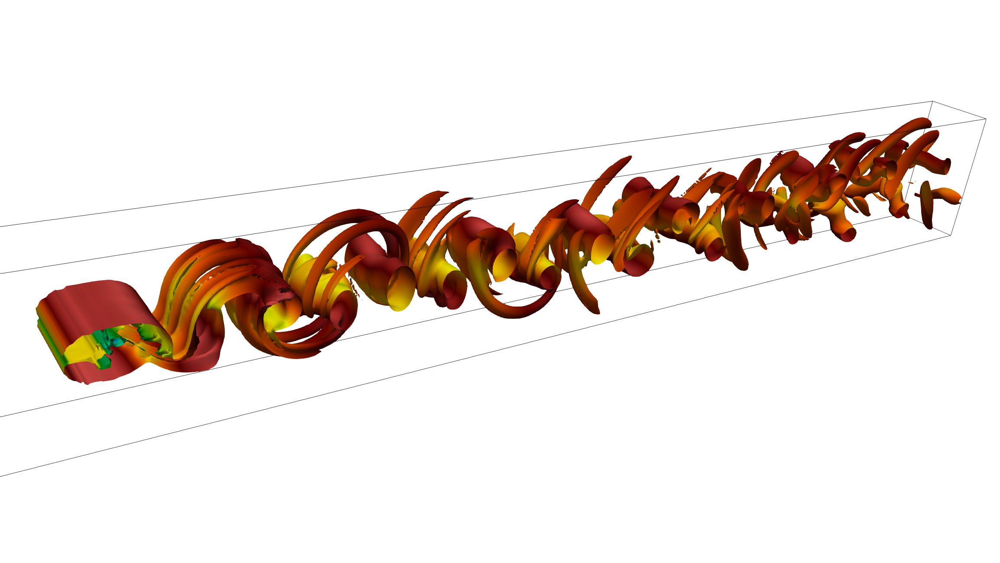

======================================
Turbulent flow around a smooth cylinder
======================================
The turbulent wake generated by a smooth cylinder is a well-known benchmark in CFD. It is attractive as a test case due to its simple setup, and it is well documented in the literature with plenty of database available. It can be used as as starting point to discover how to use an immersed boundary method.

DNS Re=300 for a fixed cylinder
================================
Have a look at the following `video <https://youtu.be/RFE_hUD-xuk>`_ to see how to run a turbulent flow around a smooth cylinder simulation with Xcompact3d and post-process the data with Py4Incompact3d. 

In the video, it is shown how to perform a Direct Numerical Simulation of the turbulent flow around a smooth cylinder case with a Reynolds number equal to 300. The simulation should take few hours on a dozen of CPU cores to collect converged statistics. The idea is to reproduce figure 4 of *Bartholomew, P., Deskos, G., Frantz, R. A., Schuch, F. N., Lamballais, E., & Laizet, S. (2020).* **Xcompact3D: An open-source framework for solving turbulence problems on a Cartesian mesh.** *SoftwareX, 12, 100550.*, `web link <https://www.sciencedirect.com/science/article/pii/S2352711019303620>`_, but with a lower spatial resolution.

You will see how to use **Paraview** to visualise the snapshots, **Gnuplot** to visualise the temporal evolution of the lift and drag coefficients, and **Py4Incompact3d** to generate the statistics (mean streamwise velocity profiles and rms of the streamwise velocity). The key parameters in the input file are also discussed in the videos.

For this case, ``input_DNS300_LR.i3d`` from the ``examples/Cylinder`` directory is used. The statistics generated with **Py4Incompact3d** are compared with one set of reference data (available in ``examples/Cylinder` directory of **Py4Incompact3d**):

-*Mittal, R., & Balachandar, S. (1997, June).* **On the inclusion of three-dimensional effects in simulations of two-dimensional bluff-body wake flows.** *In ASME fluids engineering division summer meeting (pp. 1-6).*

Information are provided on how to change the geometry of the immersed moving object. It is recommended to read *Giannenas, A. E., & Laizet, S. (2021).* **A simple and scalable immersed boundary method for high-fidelity simulations of fixed and moving objects on a Cartesian mesh.** *Applied Mathematical Modelling, 99, 606-627.* for a better understanding on how the immersed boundary method implemented in Xcompact3d is working.

DNS Re=300 for a moving cylinder
================================
Have a look at the following `video <https://www.youtube.com/watch?v=3SE6qKL-VyY>`_ to see how to run a simulation with a moving cylinder with Xcompact3d. 

For this case, ``input_DNS300_LR_MOVING.i3d`` from the ``examples/Cylinder`` directory is used. The ambient fluid is moving at a constant velocity of 0.5 in the streamwise direction while the cylinder is moving at a constant velocity of -0.5. Information are provided on how to change the geometry of the immersed moving object. It is recommended to read *Giannenas, A. E., & Laizet, S. (2021).* **A simple and scalable immersed boundary method for high-fidelity simulations of fixed and moving objects on a Cartesian mesh.** *Applied Mathematical Modelling, 99, 606-627.* for a better understanding on how the immersed boundary method implemented in Xcompact3d is working.

