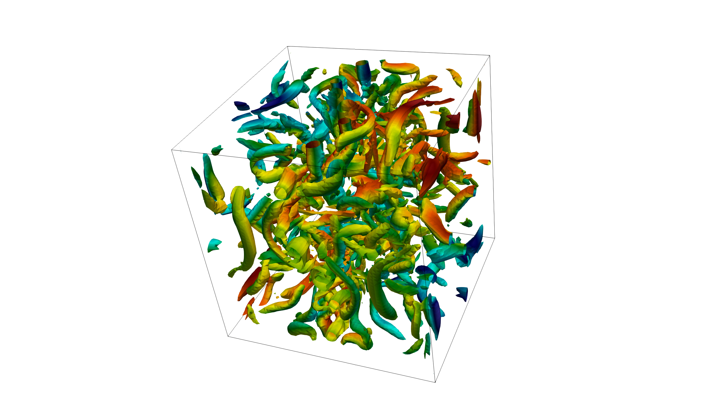

=====================
Taylor-Green Vortices
=====================
The Taylor–Green Vortex (TGV) is a well-known benchmark in CFD, modelling the transition from an initially laminar state to a fully turbulent one. It is attractive as a test case due to its simple setup, with the possibility to use a combination of
periodic and free-slip boundary conditions

DNS Re=1,600
=============
Have a look at the following `video <https://www.youtube.com/watch?v=yj0njXod7iU>`_ to see how easy it is to run a Taylor Green Vortex simulation with Xcompact3d. 

In the video, it is shown how to perform a Direct Numerical Simulation of the Taylor Green Vortex case with a Reynolds number equal to 1,600.

You will see how to use **Paraview** to visualise the snapshots and **Gnuplot** to visualise the statistics. Examples are provided with free slip and periodic boundary conditions. The key parameters in the input file are also discussed.

For the free slip case, ``input_DNS_Re1600.i3d`` from the ``examples/Taylor-Green-Vortex`` directory is used, and in the video you can see how to modify this input file for the periodic case.

ILES Re=5,000
=============
Have a look at the following `video <https://youtu.be/3zCU3J2tQTU>`_ to see how to perform an Implicit Large Eddy Simulation of the Taylor Green Vortex case with a Reynolds number equal to 5,000. It is recommanded to first watch the video of the Taylor Green Vortex case with a Reynolds number equal to 1,600.

This case (with ``input_ILES_Re5000.i3d``) corresponds to the case number 4 described in *Dairay, T., Lamballais, E., Laizet, S., & Vassilicos, J. C. (2017).* **Numerical dissipation vs. subgrid-scale modelling for large eddy simulation.** *Journal of Computational Physics, 337, 252-274*, `web link <https://www.sciencedirect.com/science/article/pii/S0021999117301298>`_.

Please read the paper if you are not familiar with the technique which is based on a targeted numerical dissipation introduced by the discretization of the viscous term. This regularisation technique is equivalent to the use of spectral vanishing viscosity. The flexibility of the method ensures high-order accuracy while controlling the level and spectral features of this purely numerical viscosity. There is no extra cost associated with this strategy, unlike explicit approaches which could dramatically increase the computational cost, especially if filtering procedures are invovled.

Reference data for Reynolds numbers ranging from 1,250 to 20,000 can be found `here <https://zenodo.org/record/2577239#.YsV6GozMI5k>`_. The reference data for Re=1,600 and Re=5,000 are also available in the ``examples/Taylor-Green-Vortex`` directory

