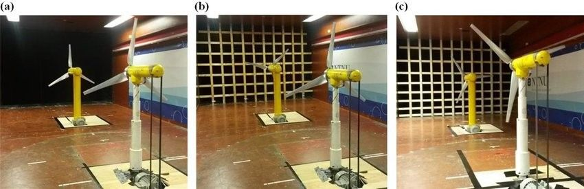
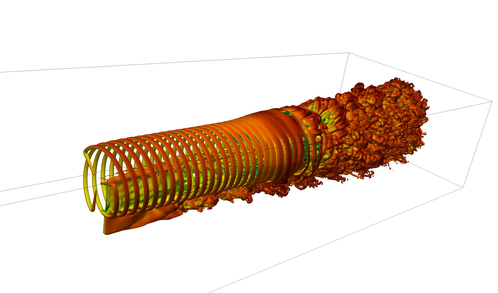

======================================
Wakes of two aligned turbines
======================================
This test case is based on a wind turbine case for which two generic wind turbines are aligned and subject to an incoming uniform wind. The files required for this case are provided in ``examples/Wind-Turbine/two_turbines``. Note that for this simulation, the data are dimentionalised with meters, kilograms and seconds.

The setup is similar to the following experiments:

Picture extracted from *Bartl, J., & Sætran, L. (2017).* **Blind test comparison of the performance and wake flow between two in-line wind turbines exposed to different turbulent inflow conditions.** *Wind energy science, 2(1), 55-76.*

It is recommanded to read the following two publications for a better understanding of the wind farm capabilities of Xcompact3d:

1-*Deskos, G., Laizet, S., & Palacios, R. (2020).* **WInc3D: A novel framework for turbulence‐resolving simulations of wind farm wake interactions.** *Wind Energy, 23(3), 779-794.*

2-*Deskos, G., Laizet, S., & Piggott, M. D. (2019).* **Turbulence-resolving simulations of wind turbine wakes.** *Renewable energy, 134, 989-1002.*

Have a look at the following `video <https://youtu.be/c_VECB0N0LE>`_ to see how to run this test case and to visualise the temporal evolution of the power output with **gnuplot**, and the magnitude of the vorticity field with **Paraview**. The simulation is performed in 1H36min on `ARCHER2 <https://www.archer2.ac.uk/>`_, the UK supercomputing facility, using 256 CPU cores. About 12GB of data are produced, mainly 3D snapshots of the flow. Note that for this simulation, we did not collect the statistics (but this can easily be done if you want to look at velocity profiles in the wakes).

The simulation is performed via the implicit approach implemented in Xcompact3d. Please read the paper *Dairay, T., Lamballais, E., Laizet, S., & Vassilicos, J. C. (2017).* **Numerical dissipation vs. subgrid-scale modelling for large eddy simulation.** *Journal of Computational Physics, 337, 252-274* if you are not familiar with the technique which is based on a targeted numerical dissipation introduced by the discretization of the viscous term. This regularisation technique is equivalent to the use of spectral vanishing viscosity. The flexibility of the method ensures high-order accuracy while controlling the level and spectral features of this purely numerical viscosity. There is no extra cost associated with this strategy, unlike explicit approaches which could dramatically increase the computational cost, especially if filtering procedures are invovled.

The parameters of the turbines can be changed in ``BT2_1.turb`` and  ``BT2_2.turb`` for the first and second turbines, respectively. The power output (as well as oter quantities of interest) for the first and second turbines can be extracted from the ``*.perf`` files using the Python file ``power.py``. The extracted power is in Watts.

