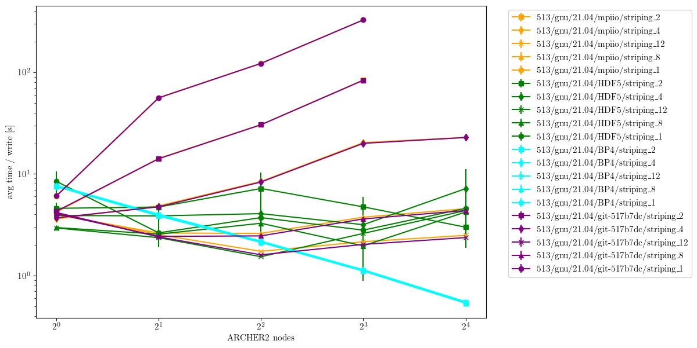

==================
Performance Tuning
==================

This section contains advice to obtain the best possible performance with a focus on large-scale
runs on clusters/supercomputers.

------------------
I/O
------------------

Many clusters/supercomputers will have a Luster-based filesystem for production I/O (other parallel
filesystems exists, but this will focus on Lustre), these provide the illusion of a single disk when
the filesystem is infact backed by several disks with the goal of increasing I/O bandwidth by
writing to multiple disks simultaneously.
In Lustre this is known as "striping" - a file can be striped over 1 or more disks, allowing
multiple readers/writers to access their portion of the file simultaneously.
The simplest way to enable striping of a file is by inheritance i.e. it will take the same striping
as the directory it is created in (the same applies to sub-directories), therefore to set striping
of a run the job submission script should contain code similar to

.. code-block::

   export RUNDIR=/path/to/run

   mkdir ${RUNDIR}
   lfs setstripe -c ${nstripe} ${RUNDIR}

   cd ${RUNDIR}
   # Copy input, etc. to rundir

   srun xcompact3d # Run the job

note that the striping is set before copying any data into the running directory, this and any I/O
performed by the job will then inherit the striping of the running directory.
The ``nstripe`` variable sets the number of stripes, this can be any value between 1 and the maximum
number of stripes supported by the system with the special values 0 and -1 specifying the default
and maximum striping, respectively.
To check the maximum striping available, create a temporary directory and stripe it as follows

.. code-block::

   mkdir foo

   lfs setstripe -c -1 foo

   touch foo/bar
   lfs getstripe foo/bar

the final command will report the striping of the file ``foo/bar`` (the output is easier to
interpret for files than directories).

To illustrate the potential benefit of striping for Xcompact3d the following graph shows the time
per write step using the MPIIO, ADIOS2/HDF5 and ADIOS2/BP4 backends [#fn1]_ (Xcompact3d commit
``3778480``, ``git-517b7dc`` refers to a commit prior to ADIOS2 integration to verify the MPIIO
performance), note the anti-scaling of MPIIO performance at low stripe counts which can be
alleviated using more striping.

   Average time per I/O step for 10 timesteps of TGV 513^3, averaged over 3 submissions, writing 4
   fields (u, v, w, p) in double precision.

.. rubric:: Footnotes

.. [#fn1] Data obtained on ARCHER2 as part of the ARCHER2/eCSE0302 project.
