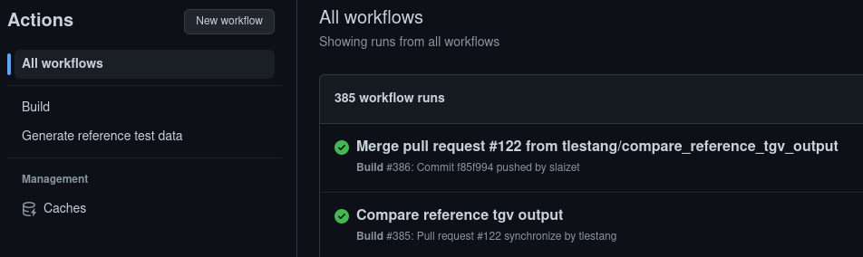
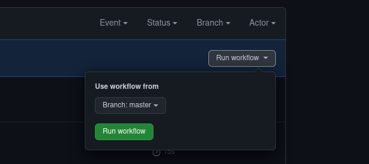

# Automated Taylor-Green vortex test case
The CTest case for the Taylor-Green-Vortex run and compare with a reference solution. 
Assuming a default build as described in the [installation description](../../INSTALL.md), 
this is equivalent to perfrom the following steps: 

```
./build/opt/bin/xcompact3d tests/TGV-Taylor-Green-Vortex/reference_input.i3d 
python3 tests/TGV-Taylor-Green-Vortex/compare_TGV_time_evolution.py \
        --input time_evol.dat \
        --reference tests/TGV-Taylor-Green-Vortex/reference_time_evol.dat
```

## Reference output data

The file `tests/TGV-Taylor-Green-Vortex/reference_time_evol.dat` contains
reference output values for the TGV test case. The values were
generated base on input file `reference_input.3d` and running the `xcompact3d`
executable as

```
mpirun -np 2 build/opt/bin/xcompact3d
```

See metadata.txt for the revision number the executable was compiled from, as well as
`gfortran` and OpenMPI versions.

### Generating reference output data

It is possible to update and push new test data manually. However, **for
reliability and consistency reasons the recommended way is to generate
output data through the dedicated GitHub action** *Generate reference
test data*.

On the "Actions" tab, select the *Generate reference test data* action
on the left hand side panel:



Next, trigger the workflow on the `master` branch run by clicking on
*Run workflow* as shown below.



Following successful completion, the workflow will open a new Pull
Request titled /Update reference output TGV data/. 

## Automated test on Pull Request

The above test will run automatically each time new commits are pushed
to a remote branch for which a Pull Request is open for integration in
the `master` branch.

This workflow is based on GitHub actions and described in the
[.github/workflows/Build.yml](https://github.com/xcompact3d/Incompact3d/blob/master/.github/workflows/Build.yml) configuration file. This workflow

1. Builds and caches OpenMPI.
2. Builds Incompact3d.
3. Runs the `xcompact3d` executable on reference input file `reference_input.i3d` and compare the results


